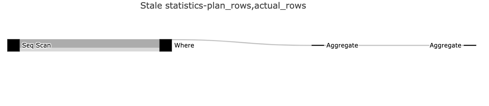

# Query Optimization for Mere Humans

# About Me 🙈

 

- Data architect at bigabid 👷.
- Data architect consultant 🤓.
- Big passion for python, big data, databases and machine learning 🐍🤖.
- Online at [medium](https://medium.com/@Eyaltra) | [website](https://eyaltrabelsi.github.io/) 🌐

# Today ⌛


 


- Problem Overview.
- Execution Plans.
- 2 Fake Examples.
- Can database interaction be better?


 # Identify flaws in queries is tough🩺


 


- Its require skill to write sql queries without error.
- Its require skill to optimize sql queries.
- Databases provide execution plans

# Query Execution Flow 🪜


 


**We want to reduce mental capacity !!** - [but if you want to go the extra mile](https://www.interdb.jp/pg/pgsql03.html).

- **My opinion** still a way to go in terms of toolings.
- We are stuck with **execution plans**.
- **Buzzword alert !!** we should democretized execution plans.

# Let's explain Explain 📜


 


- **explain**: show what the planner planned to do.
- **explain analyze**: what the planner plans to do, **executes the query** and also shows how it did it.


``` mysql
EXPLAIN [ ( option [, ...] ) ] statement
```
``` sql
- ANALYZE [ boolean ]
- VERBOSE [ boolean ]
- COSTS [ boolean ]
- SETTINGS [ boolean ]
- BUFFERS [ boolean ]
- WAL [ boolean ]
- TIMING [ boolean ]
- SUMMARY [ boolean ]
- FORMAT { TEXT | XML | JSON | YAML }

```


 

- **Pro Tip**💃: go over an execution plan at least once; similar across databases.
- **Pro Tip**💃: prefer EXPLAIN ANALYZE as it holds more information.


# Why shouldn't I always use explain analyze? 😵‍💫


 

- Destructive operations.
- When resources are scarce:
    - The query never finishes.
    - Monitoring production.
- When you don't need actual stats:
    - Checking index usage.
    - Checking partition scans.
- When checking query compilation.

- use transactions in case of destructive operations so that you can ROLLBACk the changes.

# Explain Anatomy🫀

 

``` postgresql
EXPLAIN ANALYZE
SELECT COUNT(*) FROM users WHERE twitter != '';
```


- Look crypted at first :( . 
- It's longer than our query :(( .
- Real-world execution plans are overwhelming if you dont focus :(( . 


- Query execution took 1.27 seconds.
- Query planning took 0.4 millis.


- Structured as inverse tree.
- **Many operations**: 'Seq Scan', 'Values Scan', 'Sample Scan', 'Function Scan', 'CTEScan', 'Index Scan', 'Bitmap Heap Scan', 'Bitmap Index Scan', 'Index Only Scan','Subquery Scan', 'Hash Join','Nested Loop', 'Merge Join', 'Hash', 'Gather', 'Gather Merge','Unique','Result', 'SetOp', 'GroupAggregate','Aggregate', 'HashAggregate', 'WindowAgg', 'Limit', 'Sort', 'materialize', 'LockRows', 'Append', 'Merge Append' etc.

 

- **Pro Tip**💃: Cheat on your homework with [explain glossary](https://www.pgmustard.com/docs/explain).
- **Pro Tip**💃: Focus is key.


- **Plan Rows**: the estimated number of produced rows of Aggregate node is 1.
- **Actual Rows**: the actual number of produced rows of Aggregate node is 1 (per-loop average).
- **Plan Width**: the estimated average size of rows of Aggregate node is 8 bytes.
- the estimated number of rows cam be off depending on statistics.


- **Startup Cost**: arbirary units that represent estimated time to return the first row of Aggregate node is 845110(aggregated).
- **Total Cost**: arbirary units that represent estimated time to return all the rows  of Aggregate node is 845110 (aggregated). 
- **Actual Startup Time**: the time it took to return the first row in ms  of Aggregate node is 1271.157 (aggregated). 
- **Actual Total Time**: the time it took to return all the rows in ms of Aggregate node is 1271.158 (per-loop average and aggregated).


 

- **Actual Loops**: the number of loops the same node was executed is 1.
- To make the numbers comparable with the way the cost estimates are shown.
- To get the total time and rows, the actual time and rows need to be multiplied by loops values.

 

- **Pro Tip**💃: be wary of loops.


- We may not get the optimal execution plan.
- Finding the best execution plan is NP-hard.
- The planning time may be longer than the execution time. 

- Prepared statements potentially have the largest performance advantage when a single session is being used to execute a large number of similar statements. 
- The performance difference will be particularly significant if the statements are complex to plan or rewrite
- if the query involves a join of many tables or requires the application of several rules. 

# When explain will work?🤔

 

<br>

    + Implies reasons why a query was slow.
            - Missing indices.
            - Overused indices.
            - Missing partitions.
            - Unoptimized database configurations*.
            - Redundant Operations.
            - Stale statistics.
    + Implies reason why query cardinality is wrong:
            - Missing records.
            - Too many records.
            - Duplications. 

    - Doesn't tells you why a particular optimization is not used.
    - Doesn't tells you how to rewrite your queries.

# Example: Performance Optimization🐆

``` postgresql
EXPLAIN ANALYZE
SELECT COUNT(*) FROM users WHERE twitter != '';
```


- We perform a [sequential scan](https://www.pgmustard.com/docs/explain/sequential-scan) on the users table.
- The scan filters out 2,487,813 rows.
- It takes us 1.27 seconds to do all of this.

- **Pro Tip**💃: Focus on the node on the "worst" node.


``` postgresql
CREATE INDEX twitter_test ON users (twitter)
```


- We perform an [index only scan](https://www.pgmustard.com/docs/explain/index-only-scan) on the users table.
- It takes us 0.29 seconds instead of 1.27 seconds.
- We could use buffers to be more precise.

- **Pro Tip**💃: optimize queries a step by step.
- **Pro Tip**💃: When comparing execution plans, look at several metrics. 

``` postgresql
EXPLAIN (ANALYZE, BUFFERS)
SELECT COUNT(*) FROM users WHERE twitter != ''
```


- The scan filters out 2,487,813 rows.
- We have 51,854 pages to read all from cache (400 MB).
- We have written 19 pages to disk.

- Let's execute the query a second time, now that the cache is warmed up. One of the reason it does so is that our table is bigger than the cache.

- **Pro Tip**💃: there is no free lunch.

# Good optimization options🤞🏻

 

- Picking the right scan method.
- Picking the right join method.
- Picking the right join order.
- Push Filters as soon as possible.
- Reducing disk IO operations when needed.    


 

- **Pro Tip**💃: can enable/disable settings to check optimizations.

``` mysql
SET enable_seqscan TO off;
EXPLAIN (ANALYZE) SELECT * FROM foo WHERE c1 > 500;
SET enable_seqscan TO on;
```

# Example: Empty Results🐛

 

``` postgresql
EXPLAIN ANALYZE
SELECT COUNT(*) FROM users WHERE twitter = 'd0n@ldtrump';
```


 

- We perform a [sequential scan](https://www.pgmustard.com/docs/explain/sequential-scan) on the users table.
- The scan filters out all rows using a Filter.


``` postgresql
EXPLAIN ANALYZE
SELECT COUNT(*) FROM users WHERE twitter = 'donaldtrump';
```


- **Pro Tip**💃: in case we know a problem exists it is a productive tool.
- **Pro Tip**💃: in case we don't know a problem exists it may protect us.


# Aren't there easier ways?!🙏


 

- UI can be nice.
- Hints how to rewrite your queries. 
- Hints why a particular optimization is not used. 
- Hints why/where a particular issue orinated.


- Basic tools to understand execution plans like [pgAdmin](https://www.pgadmin.org/).
- Cooler tools to understand execution plans out there like [pev2](https://github.com/dalibo/pev2), [explain.depesz.com](explain.depesz.com),  [eversql](https://www.eversql.com/), [pgMustard](https://www.pgmustard.com/) and  [QueryFlow](https://github.com/eyaltrabelsi/query-flow)
- Other tools like [auto_explain](https://www.postgresql.org/docs/current/auto-explain.html) and [pg_stat_plans](https://github.com/2ndQuadrant/pg_stat_plans) to record the execution plans.    

 

- **Pro Tip**💃: use one of these to make life easy.


## [pev2](https://github.com/dalibo/pev2)


    + Mature
    + Not opinionated.
    + UI indicates the proportions of metrics and problematic operations.
    - Focus on single query/metric for Postgresql.

## [QueryFlow](https://github.com/eyaltrabelsi/query-flow)




    + Support multiple metrics/queries/engines.
    + Operations are linkable with examples.
    + UI indicates the proportions of metrics and problematic operations.
    - Not mature
    - Very opinionated.
    - Require installations*.

# Optimistic Future🔮


 

- Integrated in IDEs, clients, saas and so on.
- Easy and intuitive as opening files in python/js (googling).
- Proactive // Reactive.

 


- [Deeper Understanding of PostgreSQL Execution Plan (video)](https://www.youtube.com/watch?v=Ls-uE1V31lE&list=WL&index=5&ab_channel=PostgresConference)
- [EXPLAIN Explained (video)](https://www.youtube.com/watch?v=mCwwFAl1pBU&ab_channel=SouthernCaliforniaLinuxExpo)
- [Understanding Explain](https://public.dalibo.com/exports/conferences/_archives/_2012/201211_explain/understanding_explain.pdf)
